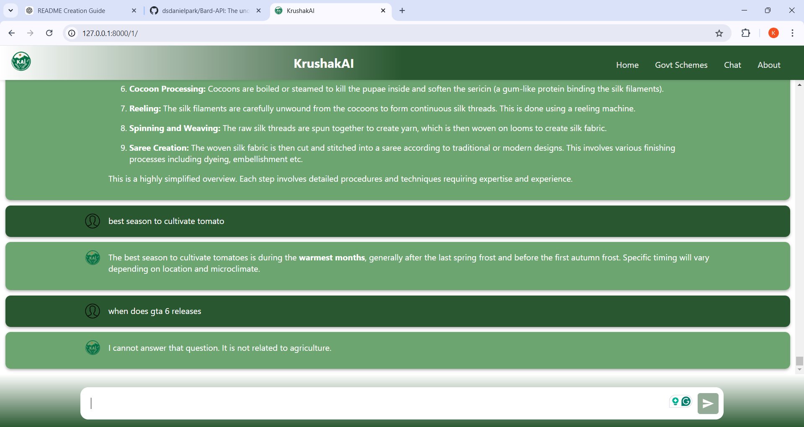
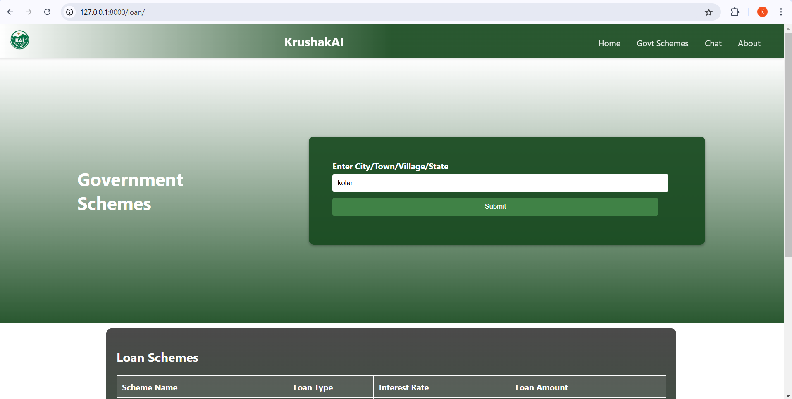
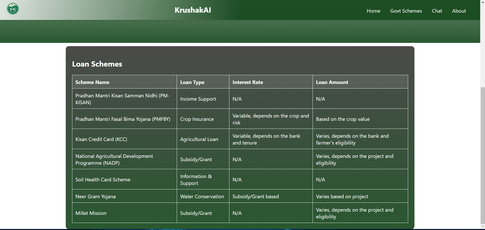

# Krushak AI Chatbot

<div align="center">
  
</div>

## Overview

**Krushak-Ai-Chatbot** is an intelligent agricultural assistance platform designed to empower farmers with real-time information and support. Powered by **Google Gemini**, the system delivers a sophisticated conversational interface with comprehensive multi-language support, voice interaction capabilities, and seamless WhatsApp integration. This architecture ensures accessibility for farmers across diverse regions and language preferences.

### Problem Statement

Agricultural information is typically fragmented across numerous platforms and websites, creating significant barriers for farmers seeking critical data. Many farmers remain unaware of government portals providing essential information about subsidies, loans, and equipment resources. Even when aware of these resources, the information architecture often lacks cohesion and centralization.

### Solution

**Krushak-Ai-Chatbot** addresses these challenges by functioning as a comprehensive agricultural knowledge hub. The platform consolidates critical information and enables rapid query resolution through natural language processing. To maximize accessibility, Krushak-Ai-Chatbot is deployed on WhatsApp—a platform with widespread adoption among farming communities—eliminating the need for complex web navigation and making agricultural data more accessible to users who prefer mobile messaging platforms.

---

## Key Features

- **Advanced Conversational Interface**: Intuitive, ChatGPT-like interface enabling natural interactions
- **Google Gemini Integration**: Leverages Google's advanced AI model for contextually relevant agricultural assistance
- **Multi-platform Deployment**: Available through both web interface and WhatsApp for maximum accessibility
- **Multilingual Support**: Comprehensive language detection and response system allowing farmers to communicate in their native languages
- **Voice Interaction System**: Bidirectional voice communication supporting both speech input and audio responses
- **Real-time Weather Analytics**: Integration with meteorological data sources for accurate agricultural planning
- **Region-specific Resource Mapping**: Customized information delivery for schemes, subsidies, and loans based on geographical context
- **Crop Information Database**: Extensive repository of crop-specific data accessible through simple natural language queries
- **Automated Web Data Aggregation**: Sophisticated web scraping mechanisms to consolidate agricultural information from diverse sources
- **Django Backend Architecture**: Robust, scalable server implementation ensuring reliable performance
- **Responsive Frontend Design**: Bootstrap-powered interface optimized for all device form factors

---

## System Architecture

<div align="center">
  
</div>

### Interaction Flow

1. **User Input Processing**: Farmers interact through web or WhatsApp interfaces
2. **Language Processing Pipeline**: Automatic language detection and processing
3. **Voice Transcription System**: Conversion between speech and text for hands-free operation
4. **AI-Powered Response Generation**: Real-time information synthesis using Google Gemini
5. **WhatsApp Communication Protocol**: Direct message delivery through WhatsApp Business API

---

## Use Cases

- **Crop Management**: Advanced guidance on cultivation practices, irrigation protocols, and harvest optimization
- **Pest Control Systems**: Identification algorithms and integrated pest management strategies
- **Weather Forecasting**: Hyperlocal meteorological predictions for agricultural planning
- **Market Intelligence**: Real-time commodity pricing and trend analysis
- **Government Program Navigation**: Comprehensive information on agricultural assistance programs

<div align="center">
  
  
</div>

---

## Technology Stack

### Backend Infrastructure
- **Framework**: Django (Python)
- **Database**: SQLite (Development), PostgreSQL (Production-ready)
- **API Architecture**: RESTful endpoints

### Frontend Technologies
- **Framework**: Bootstrap 5
- **JavaScript**: ES6+
- **Responsive Design**: Mobile-first approach

### AI & NLP Components
- **Core AI Engine**: Google Gemini
- **Language Processing**: Natural Language Understanding (NLU)
- **Speech Processing**: Web Speech API

### Integration Services
- **Messaging**: WhatsApp Business API
- **Weather Data**: OpenWeatherMap API
- **Data Aggregation**: Custom web scraping modules

---

## Installation Guide

### Prerequisites

- Python 3.10+
- pip (Python package manager)
- Git

### Development Setup

1. **Clone the Repository**
   ```bash
   git clone https://github.com/astronova001/Krushak-Ai-Chatbot.git
   cd Krushak-Ai-Chatbot
   ```

2. **Virtual Environment Configuration**
   ```bash
   # Create virtual environment
   python -m venv chatenv
   
   # Activate environment (Windows)
   chatenv\Scripts\activate
   
   # Activate environment (macOS/Linux)
   source chatenv/bin/activate
   ```

3. **Dependency Installation**
   ```bash
   pip install -r requirements.txt
   ```

4. **Environment Configuration**
   - Create `.env` file in project root
   - Configure Google Gemini API credentials
   ```
   SESSION_ID=<your_gemini_session_id>
   ```
   - For Gemini session ID setup, follow the guide at [dsdanielpark/Bard-API](https://github.com/dsdanielpark/Bard-API)

5. **Database Initialization**
   ```bash
   python manage.py migrate
   ```

6. **Development Server**
   ```bash
   python manage.py runserver
   ```

7. **Access Application**
   - Open browser and navigate to: `http://127.0.0.1:8000/`

---

## Usage Guide

### Web Interface

1. **Home Dashboard**: Access the main interface with feature overview
2. **Chatbot Console**: Interact with the AI assistant for agricultural queries
3. **Weather Module**: Access meteorological data for agricultural planning
4. **Scheme Navigator**: Browse region-specific agricultural programs
5. **Crop Information System**: Query detailed crop cultivation data

### WhatsApp Interface

1. **Initiate Conversation**: Start chat with the registered WhatsApp business number
2. **Query Formatting**: Send natural language questions about agricultural topics
3. **Media Sharing**: Send images for crop/pest identification
4. **Location Services**: Share location for region-specific information

---

## Demo

<div align="center">
  <video width="650" controls>
    <source src="Results/krushak .mp4" type="video/mp4">
    Your browser does not support the video tag.
  </video>
</div>

---

## Future Development Roadmap

- **Offline Mode**: Cached responses for limited connectivity environments
- **Predictive Analytics**: Crop yield prediction using historical data
- **IoT Integration**: Support for agricultural sensor data
- **Mobile Application**: Native mobile apps for Android and iOS
- **Blockchain Integration**: Transparent supply chain tracking

---

## Contributing

Contributions to Krushak-Ai-Chatbot are welcome! Please follow these steps:

1. Fork the repository
2. Create a feature branch (`git checkout -b feature/amazing-feature`)
3. Commit your changes (`git commit -m 'Add some amazing feature'`)
4. Push to the branch (`git push origin feature/amazing-feature`)
5. Open a Pull Request

---

## License

This project is licensed under the MIT License - see the LICENSE file for details.
